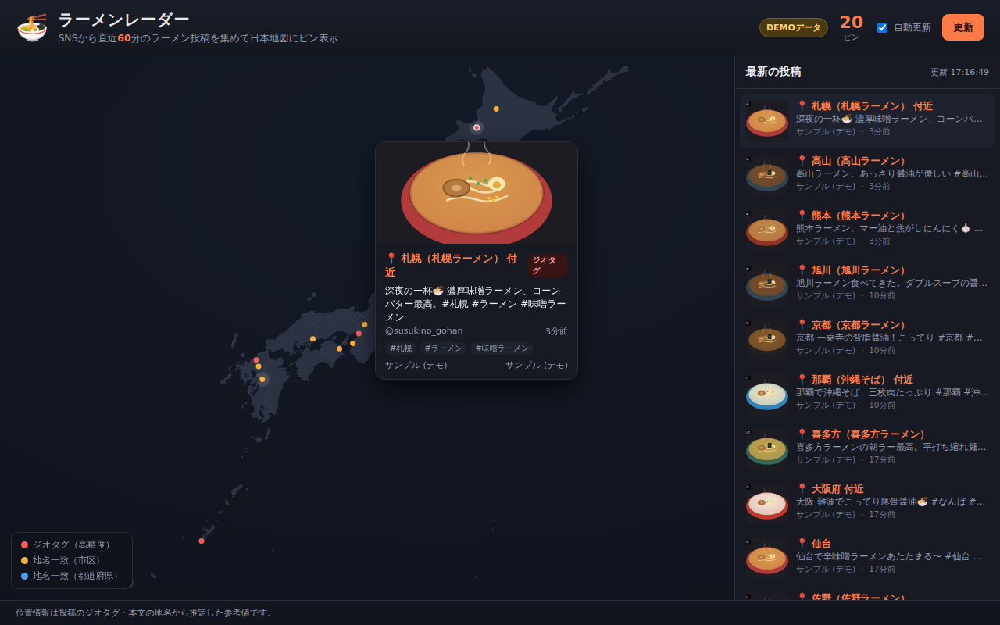

# 🍜 ラーメンレーダー (Ramen Radar)

SNS（ソーシャルメディア）から **直近1時間以内に投稿されたラーメンの画像** を集め、
投稿の **位置情報を推定** して **日本地図上にピン表示** するWebアプリＵです。
ピンやリストにマウスを乗せると、その投稿の詳細（画像・本文・投稿者・時刻・推定地・信頼度）が表示されます。



## 特長

- **直近1時間フィルタ** — 収集した投稿を投稿時刻でフィルタ（`WINDOW_MINUTES` で変更可）
- **位置推定** — 次の優先順位で緯度経度を決定
  1. 投稿のジオタグ（緯度経度）… 高信頼度
  2. 本文・ハッシュタグ・プロフィール所在地に含まれる地名 … 中／低信頼度
     （都道府県・主要都市・有名なラーメンの街 を辞書で照合。狭い地名を優先）
- **日本地図** — 外部の地図タイルやCDNに依存しない **自己完結のSVG地図**
  （47都道府県の簡略化GeoJSONを等距円筒図法で自前投影）。オフラインでも動作。
- **ホバーで詳細** — ピン／一覧のホバーで画像付きの詳細カードを表示。信頼度で色分け。
- **自動更新** — 30秒ごとに最新化（画面右上でON/OFF）
- **依存ゼロ** — サーバはNode標準の `http` のみ。`npm install` 不要。

## 使い方

```bash
npm start          # http://localhost:3000 で起動
# もしくは
node server/index.js
```

ブラウザで <http://localhost:3000> を開きます。

> **APIキーやネットワークが無くても動きます。** ライブ取得が0件の場合は
> 自動的にデモ用サンプルデータ（全国のラーメン投稿を模したもの）に切り替わり、
> 画面右上に `DEMOデータ` バッジが表示されます。

## データソース（SNS）

| ソース | 認証 | 有効化 |
|--------|------|--------|
| **Mastodon** 公開タイムライン | 不要 | 既定で有効。`MASTODON_INSTANCES` で対象インスタンスを指定 |
| **X (Twitter)** Recent Search | 要 Bearer Token | `X_BEARER_TOKEN` を設定すると有効 |
| **サンプル (デモ)** | 不要 | ライブが0件のとき自動フォールバック |

Mastodon はハッシュタグ（`#ramen` `#ラーメン` など）の公開タイムラインを
**認証不要** で取得できるため、キー無しでもそのまま実データを収集できます
（対象インスタンスへのアウトバウンド通信が許可されている環境が必要）。

## 環境変数

| 変数 | 既定値 | 説明 |
|------|--------|------|
| `PORT` | `3000` | 待ち受けポート |
| `WINDOW_MINUTES` | `60` | 「直近N分」の時間窓 |
| `MASTODON_INSTANCES` | `pawoo.net,mstdn.jp,fedibird.com,mastodon.social` | 取得対象（カンマ区切り） |
| `RAMEN_TAGS` | `ramen,ラーメン,らーめん,つけ麺,家系` | 収集するハッシュタグ |
| `X_BEARER_TOKEN` | （なし） | X API v2 のBearer Token。設定時のみX取得を有効化 |
| `X_QUERY` | `(ラーメン OR ramen OR つけ麺) has:images -is:retweet` | X の検索クエリ |
| `USE_SAMPLE_FALLBACK` | `true` | ライブ0件時にサンプルへ自動切替 |

## API

- `GET /api/posts` — 位置推定済みの投稿一覧（JSON）
- `GET /api/posts?sample=1` — デモ用サンプルを強制
- `GET /api/health` — ヘルスチェック

レスポンス例:

```json
{
  "generatedAt": "2026-07-14T17:00:00.000Z",
  "windowMinutes": 60,
  "demo": false,
  "counts": { "collected": 24, "located": 21, "unlocated": 3 },
  "posts": [
    {
      "id": "mastodon:pawoo.net:123",
      "sourceLabel": "Mastodon (pawoo.net)",
      "text": "博多ラーメン最高🍜",
      "image": "https://.../preview.jpg",
      "lat": 33.59, "lon": 130.40,
      "locationLabel": "博多（博多ラーメン）",
      "confidence": "medium", "method": "text",
      "createdAt": "2026-07-14T16:58:00.000Z"
    }
  ]
}
```

## 構成

```
server/
  index.js            HTTPサーバ（静的配信 + API、依存ゼロ）
  collector.js        収集→1時間フィルタ→位置推定→整形
  sources/
    mastodon.js       Mastodon公開タイムライン（認証不要）
    twitter.js        X API v2（任意・Bearer Token）
    sample.js         デモ用サンプル
  geo/
    gazetteer.js      日本の地名→座標の辞書
    estimate.js       位置推定ロジック
public/
  index.html / style.css / app.js
  data/japan.json     簡略化した47都道府県のGeoJSON
  images/             生成したラーメン画像（SVG）
tests/                node:test による単体テスト
```

## テスト

```bash
npm test
```

## 注意事項

- 表示される位置は投稿のジオタグや本文の地名から推定した **参考値** です。実際の店舗位置とは異なる場合があります。
- 各SNSの利用規約・APIレート制限・robots等に従って利用してください。本アプリは公開API/公開データのみを対象とします。
- 地図データ: [dataofjapan/land](https://github.com/dataofjapan/land)（パブリックドメイン）を簡略化して同梱。
